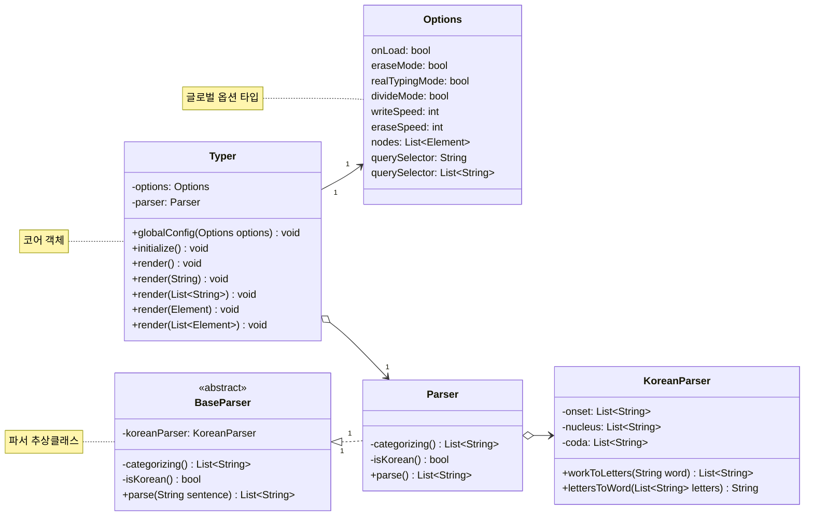
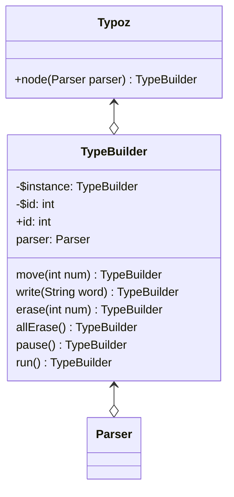

```mermaid
classDiagram
  direction LR

  Typer "1" --> "1" Options
  Typer o--> "1" Parser
  BaseParser "1" <|.. "1" Parser
  Parser o--> KoreanParser

  note for Options "글로벌 옵션 타입"
  class Options {
    onLoad: bool
    eraseMode: bool
    realTypingMode: bool
    divideMode: bool
    writeSpeed: int
    eraseSpeed: int
    nodes: List~Element~
    querySelector: String
    querySelector: List~String~
  }
  note for Typer "코어 객체"
  class Typer {
    -options: Options
    -parser: Parser
    +globalConfig(Options options) void
    +initialize() void

    +render() void
    +render(String) void
    +render(List~String~) void
    +render(Element) void
    +render(List~Element~) void
  }
  class KoreanParser {
    %% 초성
    -onset: List~String~
    %% 중성
    -nucleus: List~String~
    %% 종성
    -coda: List~String~

    %% 음절화 (자,모음 합치는 메서드)
    +workToLetters(String word) List~String~
    +lettersToWord(List~String~ letters) String
  }
  note for BaseParser "파서 추상클래스"
  class BaseParser {
    <<abstract>>
    -koreanParser: KoreanParser
    %% 분해된 단어 출력 단위 범주화
    -categorizing() List~String~
    -isKorean() bool
    %% 최종 실행 메서드
    +parse(String sentence) List~String~
  }
  class Parser {
    -categorizing() List~String~
    -isKorean() bool
    +parse() List~String~
  }
```

```mermaid
classDiagram
  class TypeBuilder {
    -$instance: TypeBuilder
    -$id: int
    +id: int
    parser: Parser
    move(int num) TypeBuilder
    write(String word) TypeBuilder
    erase(int num) TypeBuilder
    allErase() TypeBuilder
    pause() TypeBuilder
    run() TypeBuilder
  }
  class Typoz {
    +node(Parser parser) TypeBuilder
  }
  class Parser {

  }
  Typoz <--o TypeBuilder
  TypeBuilder <--o Parser
```
